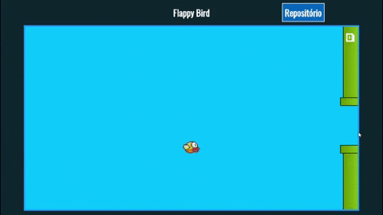

# flappyBird-js
Essa é uma versão mais simples do jogo Flappy Bird, que desenvolvi utilizando somente HTML, CSS e Javascript. 
  

Meu <strong>objetivo</strong> ao desenvolver esse projeto foi principalmente colocar em prática meus conhecimentos na linguagem Javascript. Eu adorei desenvolvê-lo, e também gostei muito do resultado final!

:arrow_forward: Você pode ver o <strong>resultado final</strong> desse projeto clicando aqui: https://tiagodiass.github.io/flappyBird-js
  

This is a simpler version of the game Flappy Bird, using only HTML, CSS and Javascript 
I've developed it with the aim of practicing my Javascript skills, I loved developing it, and the final result too! 
You can see it running clicking on the link above.

